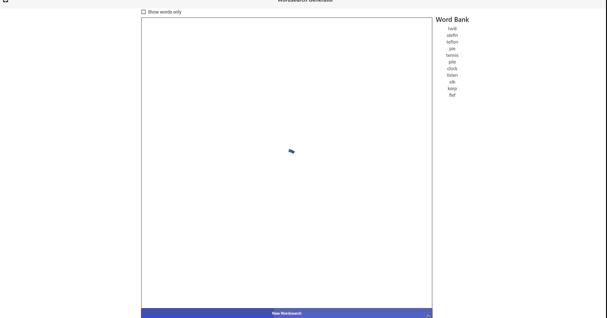

# Wordsearch Generator

A project which generates a random wordsearch, with randomly selected words,
placed in random places throughout the wordsearch. This was made to establish a
proof of concept of Angular, RxJS, and NgRx.

This repo is for the web application.
The code that generates the wordsearch itself is [here](https://github.com/n768d465/neild.wordsearch).
