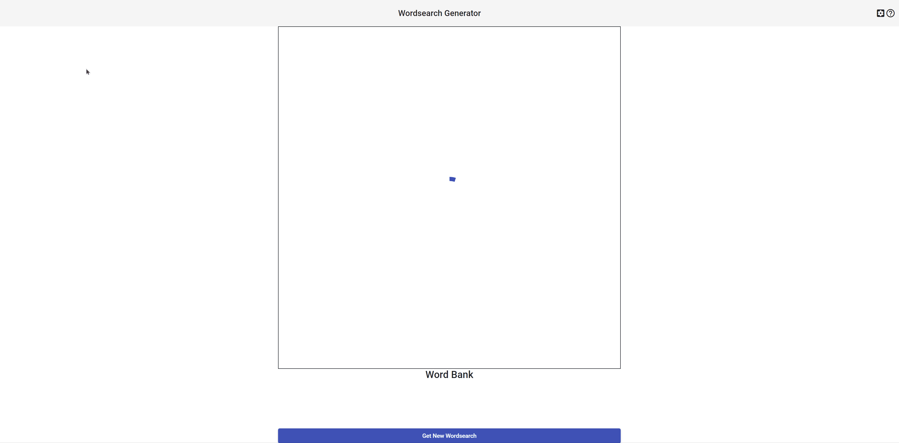

# Wordsearch Generator

A project which generates a random wordsearch, with randomly selected words,
placed in random places throughout the wordsearch. This was made to establish a
proof of concept of Angular.

This repo is for the API and the UI.
The code that generates the wordsearch itself resides [here](https://github.com/n768d465/neild.wordsearch).
